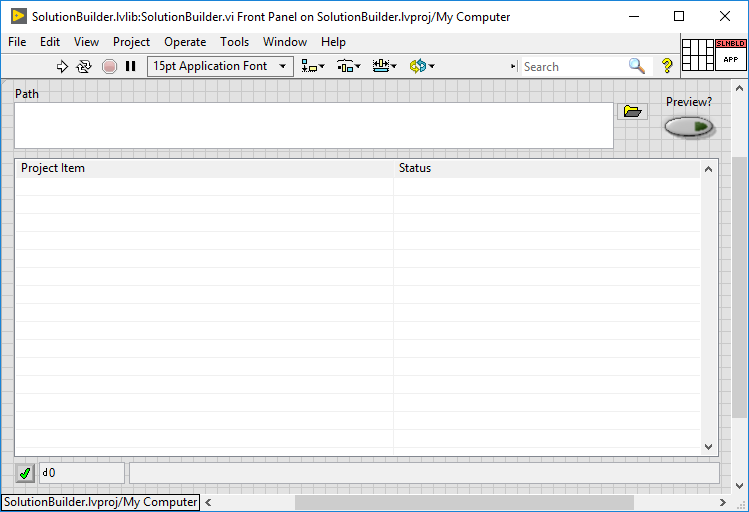

# Dependency Inspector for LabVIEW

Dependency Inspector is a tool for analyzing LabVIEW code hierarchies, architecture, and dependencies.

## Minimum Compatible LabVIEW Version

LabVIEW 2020 - Dependency Inspector uses LabVIEW Classes and Interfaces.

## Usage

...In progress...

## How to Build

*Note 1:* The first time building, open each project found in `<repo_path>/src/`, open each build specification, and verify the build destination path is valid.

*Note 2:* Verify that no Dependency Inspector projects are currently open in LabVIEW and curently loaded in memory as this will lock the built packed libraries about to be built.

1. From LabVIEW, open `<repo_path>/utils/SolutionBuilder.vi`
1. From the Front Panel's *Path* control, navigate to and select `<repo_path>/src/DependencyInspector.lvsln`
1. Click the VI's Run button.

## Additional Content

### Solution Builder

*Note:* Although Solution Builder is saved in LabVIEW 2020, it can be saved for a previous version.

Since Dependency Inspector is comprised of a handful of built packed libraries, the Solution Builder analyzes all the projects in the *src* directory, determines the build order based on the dependencies, and executes the build specifications.

From its UI, Solution Builder can act upon a directory or if given a file that specifies all the projects, can act upon the projects listed in that file.



* __Path__ : Path to a folder or to a file listing the projects.

```
#Vadid File Format
<Solution>
	<Project>C:\This\Is\A Windows Absolute Path.lvproj</Project>
	<Project>Relative\Path.lvproj</Project>
	<Project>..\Relative\Path.lvproj</Project>
	<Project>Relate Path/Forward Slash.lvproj</Project>
	<Project>../Relate Path/Forward Slash.lvproj</Project>
	<Project>/C/Linux/Absolute/Path.lvproj</Project>
</Solution>
```

* __Preview?__ : Will run the algorithm to determine the dependency build order, but will not execute the projects' build specification.

* __Results Table__ : Displays the found build specification outputs and show their build status.

* __Error/Warning Bar__ : Return any build errors or status from the utility.

## Contributions

This project welcomes Issues and Pull Requests.


